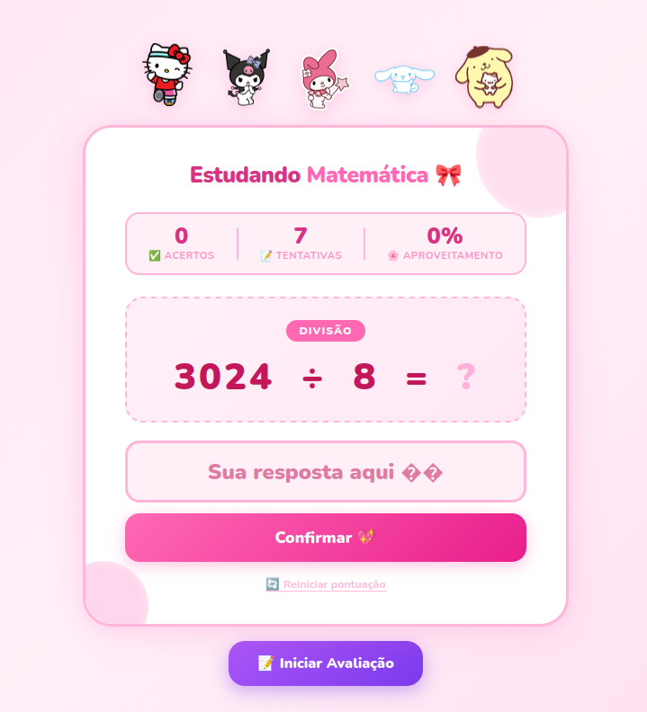
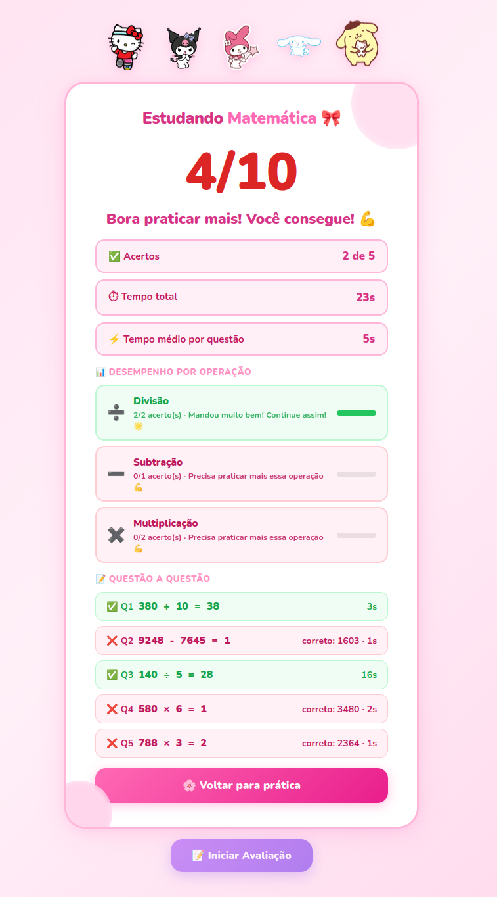

# 🎀 Estudando Matemática

App web para praticar matemática básica do 6º ano, com visual temático Hello Kitty.
Desenvolvido com auxílio do *(Claude Sonnet 4.6)*.

---

## 📸 Telas

<table>
  <tr>
    <td align="center"><b>Modo Prática</b></td>
    <td align="center"><b>Modo Avaliação</b></td>
  </tr>
  <tr>
    <td></td>
    <td></td>
  </tr>
</table>

---

## ✨ Funcionalidades

### Modo Prática
- Questões infinitas com feedback imediato após cada resposta
- GIFs animados de reação (acerto e erro)
- Placar em tempo real com acertos, tentativas e aproveitamento

### Modo Avaliação
- Contagem regressiva de 3s antes de começar
- 5 questões seguidas sem distrações, estilo prova
- Tela de loading com barra de aproveitamento animada ao final
- Resultado completo com:
  - Nota (0–10)
  - Tempo total e tempo médio por questão
  - Desempenho separado por operação com feedback personalizado
  - Detalhamento questão a questão

### Operações
| Operação | Regra |
|---|---|
| Soma | Parcelas de 3–4 dígitos |
| Subtração | Resultado sempre positivo, números grandes |
| Multiplicação | Esquerda até 3 dígitos × direita 1 dígito |
| Divisão | Divisor até 10, dividendo grande, sempre exata |

---

## 🚀 Como usar

**Pré-requisitos:** Python 3.10+ e pip

```bash
pip install flask
python app.py
```

Acesse **http://localhost:5000** no navegador.

---

## 📁 Estrutura

```
src/
├── app.py
├── static/
│   ├── gifs/
│   │   ├── acerto.gif
│   │   └── errado.gif
│   └── images/
│       ├── favicon.png
│       ├── hello_kitty.png
│       ├── kuromi.png
│       ├── my_melody.png
│       ├── Cinnamoroll.png
│       └── pompompurin.png
└── templates/
    └── index.html
```
